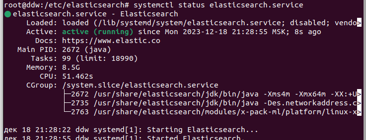
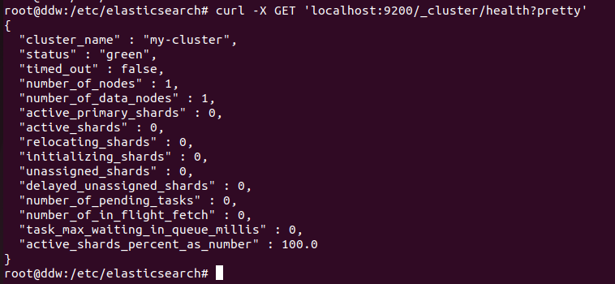
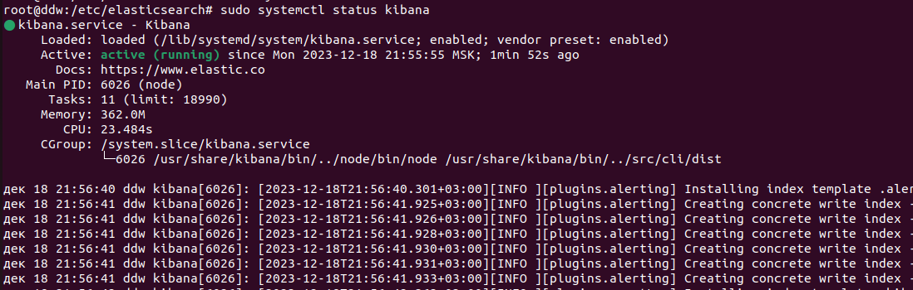
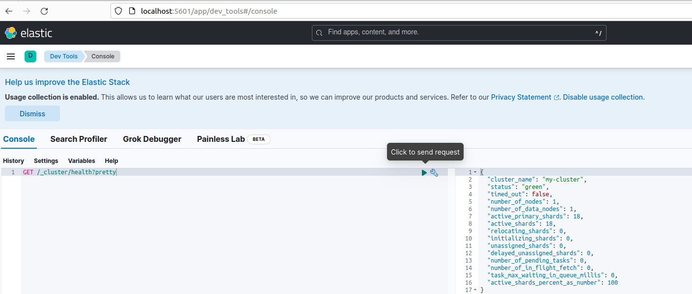
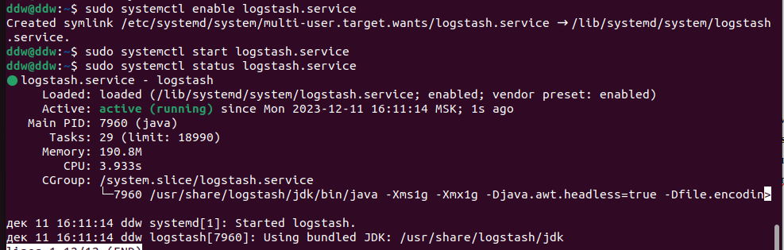
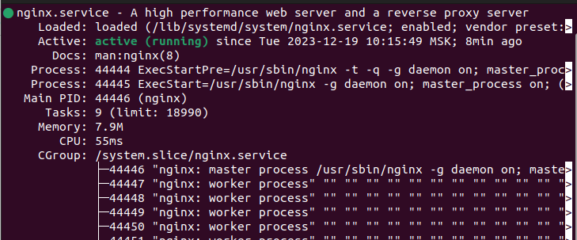
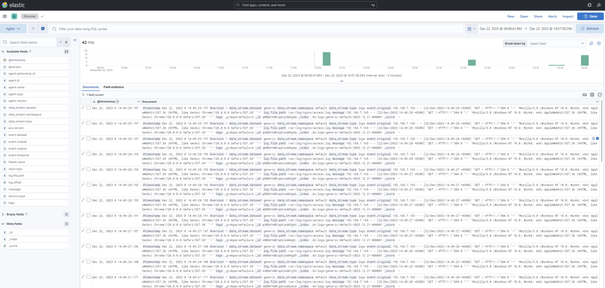
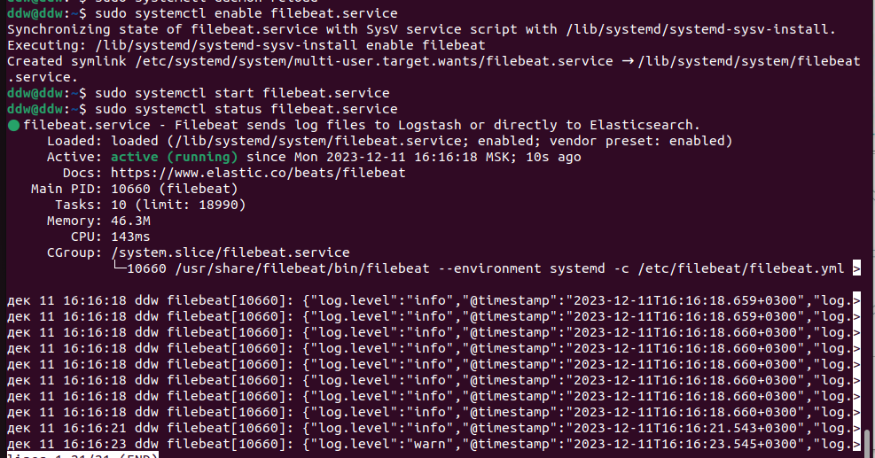
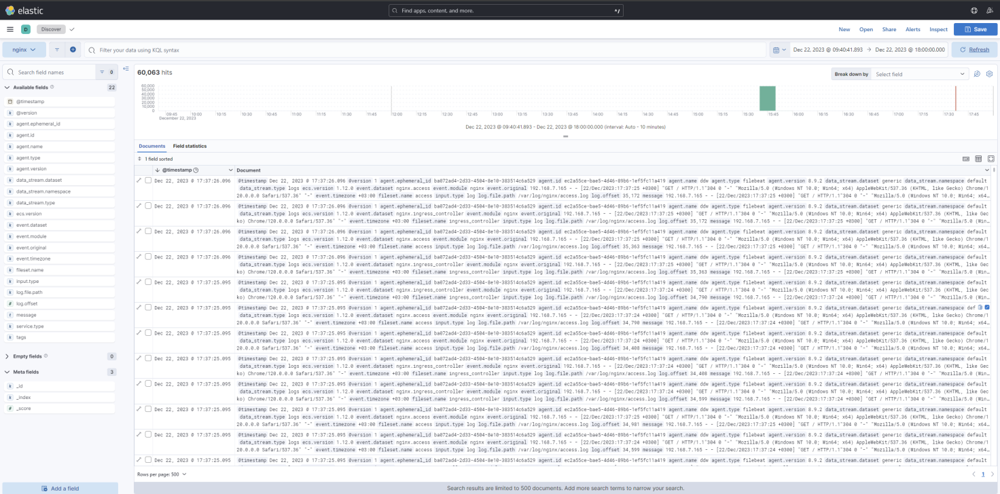

# Домашняя работа по теме «ELK»
Задание 1. Elasticsearch
Установите и запустите Elasticsearch,

после чего поменяйте параметр cluster_name на случайный.
Приведите скриншот команды 'curl -X GET 'localhost:9200/_cluster/health?pretty', сделанной на сервере с установленным Elasticsearch. Где будет виден нестандартный cluster_name.

### Задание 2. Kibana
Установите и запустите Kibana.

Приведите скриншот интерфейса Kibana на странице http://<ip вашего сервера>:5601/app/dev_tools#/console, где будет выполнен запрос GET /_cluster/health?pretty.

### Задание 3. Logstash
Установите и запустите Logstash и Nginx.

С помощью Logstash отправьте access-лог Nginx в Elasticsearch.
Приведите скриншот интерфейса Kibana, на котором видны логи Nginx.
 

### Задание 4. Filebeat.
Установите и запустите Filebeat.

Переключите поставку логов Nginx с Logstash на Filebeat.
Приведите скриншот интерфейса Kibana, на котором видны логи Nginx, которые были отправлены через Filebeat.
 

### Задание 5*. Доставка данных
Настройте поставку лога в Elasticsearch через Logstash и Filebeat любого другого сервиса , но не Nginx. Для этого лог должен писаться на файловую систему, Logstash должен корректно его распарсить и разложить на поля.
Приведите скриншот интерфейса Kibana, на котором будет виден этот лог и напишите лог какого приложения отправляется.

